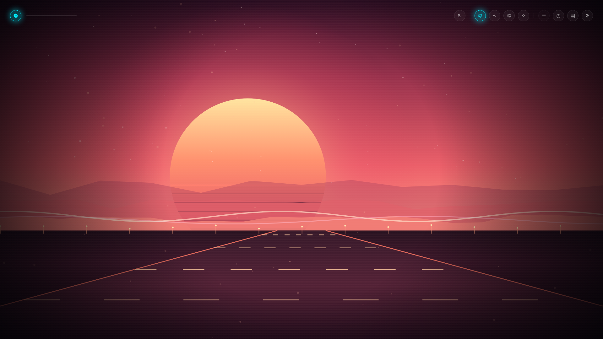
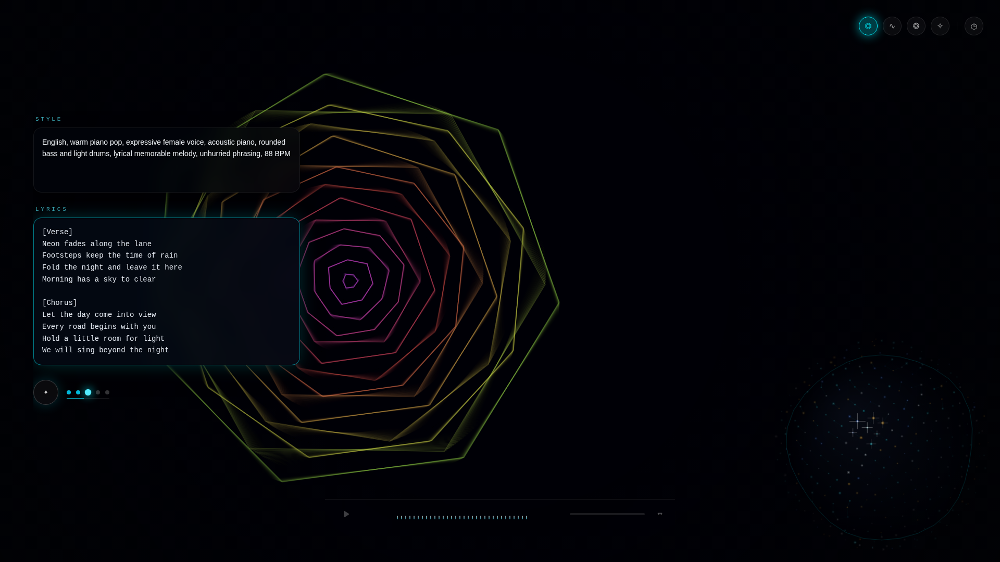
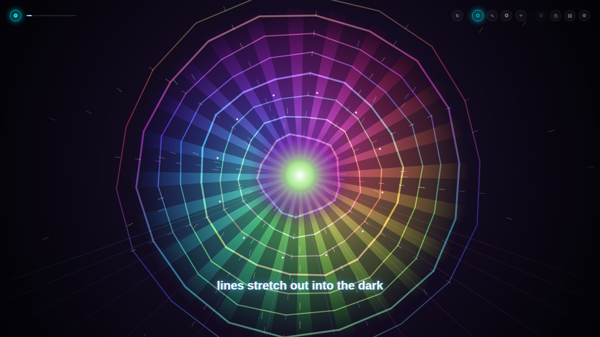
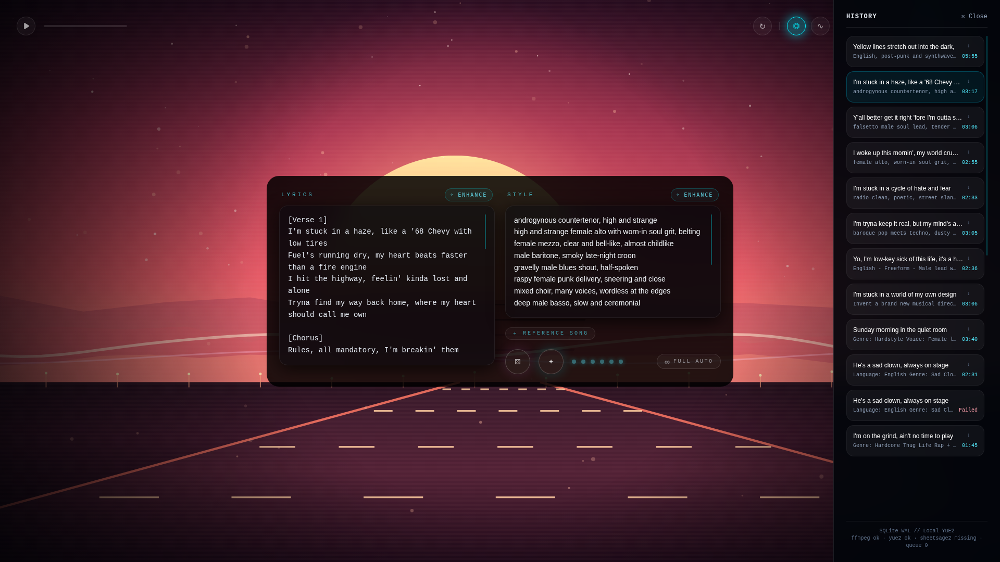
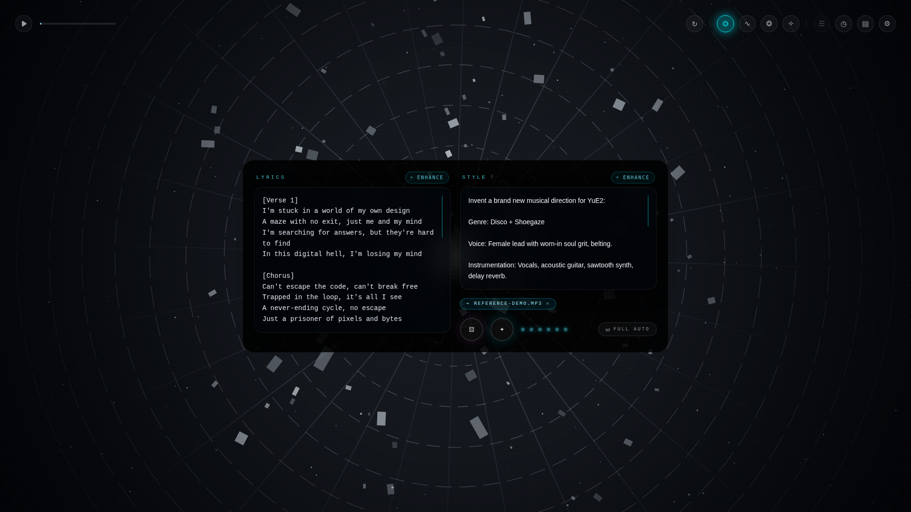

<div align="center">

# 🌀 YUEKBOX 🌀

### Because apparently GPUs are musicians now.

A local, single-user web app that turns **a style + some lyrics** into a **full song** with [YuE2](https://github.com/multimodal-art-projection/YuE) running on your machine. Just you, a graphics card, and increasingly questionable lyrics.



</div>

---

## ✨ WTF

I don't know man, nostalgia? Do you remember winamp? I do! Yuekbox harkens back
to those epic audio visualizer days, when you'd pop open ICQ and chat with somebody
half way around the world with your fire hazard of a lava lamp casting a dangerous glow
across your room, winamp blasting with some sick new visualizer on your CRT monitor
and Kazaa ripping viruses and REAL_NEW_EMINEM_FREE_NOT_FAKE.mp3 straight on to your
5400 RPM 10GB harddrive. So anyway I made this UI for Yue2, you type a vibe and some
words, hit the sparkle button, and watch the trip modes while a GPU in your house
lights on fire.

It is a **real app**, not a mockup. Under the AI skullduggery it's a Fastify server, a SQLite
queue, a worker, and the real YuE2 CLI. The visuals are just here to make the wait fun.

## 🎛️ What it does (v1)

- 🪞 **Two glass boxes.** One for style, one for lyrics.
- ✦ **Generate.** One click queues a Song and fires the worker.
- 🚦 **A queue, not a stampede.** Click generate ten times if you want. The GPU still runs one Song at a time.
- 📶 **Real progress.** Six stage pips, plus a hairline bar under them for the stages YuE2 actually counts (synthesize + decode). No fake bars for stages nobody can measure.
- 🔊 **Plays the MP3** when the Song lands, with a real spectrum fed by an `AnalyserNode`. The backdrop dances to it. Yes, really.
- ✍️ **Lyrics in the void.** While a Song plays, its lines fade in and out at the center of the page, timed to the vocal phrases detected in the rendered audio. Without a detection it falls back to the stored score. Each line settles in 0.4 s. The editor dims until you touch it.
- 🗂️ **History drawer.** Newest first. Click to play. Click to delete. Loading a song offers to replace the editor text before it stomps your draft.
- 🧪 **Keeps the score.** Every successful Song stores the ABC lead sheet for future features. v1 doesn't show it. Yet.
- ⌁ **Reference covers.** Attach a song file and SheetSage2 transcribes its melody first, then YuE2 sings your lyrics over that tune. Optional — without it you get the usual freeform generation.
- 🌈 **Four trip modes** for the background visualizer. More on that below.
- 🎨 **AI-authored backdrops.** With AI on, every new Song gets its own generated Canvas 2D visualization built from its style, its lyrics, and a randomly sampled visual direction, while the GPU is still working. It takes the backdrop over from the trip modes and owns the lyric display; reroll any Song whenever you like.
- 🧠 **Optional AI** that talks to any OpenAI-compatible endpoint — enhance, random, visualizations, full auto. Off by default. More below.

## 🖼️ Gallery

**Live progress**: pips light up per stage, and the bar tracks real step counts from YuE2's stderr.



**Playing**: the backdrop trips, the spectrum pulses, the scrubber obeys. Trip mode: Quantum Stardust Vortex.



**History**: every song, its status, its duration, one click away.



**A considerate robot**: loading a song over a dirty editor asks first.


**Reference covers**: attach a song file and SheetSage2 transcribes its melody before YuE2 sings your lyrics over it.



## 🚀 Quick start

You need:

- 🐧 Linux or WSL2 with an **NVIDIA GPU** (16 GB VRAM works with the default budget; 24 GB is YuE2's stated recommendation)
- 🐍 **Python 3.12** for the YuE2 venv
- 🎧 **ffmpeg** with `libmp3lame`
- 🥟 **[Bun](https://bun.sh) 1.4+**
- 🧠 A **YuE2 kit**: a checkout of the [YuE repo](https://github.com/multimodal-art-projection/YuE) that has `models/YuE2-3B`, `models/YuE2-Vae`, and `.venv/`
- 🎼 **Optional: SheetSage2** only if you want reference covers — a `.venv-sheetsage2` and `models/SheetSage2` inside the YuE kit

```bash
# inside the YuE checkout that has models/ and .venv/
git clone https://github.com/codenamegary/yuekbox.git ui
cd ui
bun install
bun run dev
```

Open <http://127.0.0.1:3000> and go make something weird. The API hums along on
<http://127.0.0.1:8787>. Check its vitals with:

```bash
curl -s http://127.0.0.1:3000/v1/status
# {"version":"0.1.0","state":"online","ffmpeg":"ok","yue2":"ok",...}
```

If your YuE kit lives somewhere else, point `YUE2_KIT` at it when starting the server.

### 🎼 Reference covers (optional)

Reference covers need [SheetSage2](https://huggingface.co/m-a-p/SheetSage2) to turn your uploaded
audio into a melody. Without it the app works fine; a reference upload fails cleanly on the first
generate. Install it inside the YuE kit with Python 3.10 or 3.11:

```bash
python3.11 -m venv .venv-sheetsage2
.venv-sheetsage2/bin/python -m pip install huggingface-hub==0.36.0
.venv-sheetsage2/bin/huggingface-cli download m-a-p/SheetSage2 --local-dir models/SheetSage2
.venv-sheetsage2/bin/python -m pip install torch==2.8.0 torchaudio==2.8.0 \
  --index-url https://download.pytorch.org/whl/cu126
.venv-sheetsage2/bin/python -m pip install -r models/SheetSage2/requirements.txt
```

The app finds that layout by default. When the kit has `models/MERT-v2-FullSong`, the app
uses it as the offline base model with no env var. Override with `SHEETSAGE2_PYTHON`,
`SHEETSAGE2_SCRIPT`, `SHEETSAGE2_MODEL`, or `SHEETSAGE2_BASE_MODEL` if yours differs.
`SHEETSAGE2_OFFLINE=0` allows first-run downloads through the Hugging Face cache. Uploads are
capped at 25 MB (`REFERENCE_MAX_BYTES`).

## 🤖 The "just make it work" prompt

Don't feel like reading setup docs? Paste this into Claude Code, Cursor, or any agent
with shell access to the GPU machine. It sets up YuE2 and Yuekbox from scratch.

```text
Set up Yuekbox and its YuE2 backend on this machine. Yuekbox is a local web app
that generates songs on the local GPU. Work through the steps in order and verify
each before moving on. Ask before downloading model weights (several GB).

Assumptions
- Linux or WSL2 with an NVIDIA GPU visible to `nvidia-smi`.
- `git`, `curl`, and `ffmpeg` are installed. ffmpeg must include libmp3lame;
  check with `ffmpeg -hide_banner -encoders | grep mp3`.
- `python3.12` is available. If `bun` is missing, install it with
  `curl -fsSL https://bun.sh/install | bash`.

1) Get and install the YuE2 kit (skip if you already have a YuE checkout with
   models/ and .venv/)
     git clone https://github.com/multimodal-art-projection/YuE.git
     cd YuE
     python3.12 -m venv .venv
     . .venv/bin/activate
     python -m pip install --upgrade pip
     python -m pip install .
   Verify: `.venv/bin/yue2 doctor` reports `"dependencies_ready": true`.
   If the Hugging Face download later requires access, log in first with
   `.venv/bin/hf auth login`.

2) Download the two model sets into the kit (ask me first)
     .venv/bin/huggingface-cli download m-a-p/YuE2-3B --local-dir models/YuE2-3B
     .venv/bin/huggingface-cli download m-a-p/YuE2-Vae --local-dir models/YuE2-Vae
   Verify: models/YuE2-3B/config.json and models/YuE2-Vae/config.json exist.

3) Clone Yuekbox into the kit
     git clone https://github.com/codenamegary/yuekbox.git ui
   (If it already lives elsewhere, that is fine: export YUE2_KIT to the YuE root
   that contains models/ and .venv/ when starting the server.)

4) Install and run
     cd ui
     bun install
     bun run dev
   The web app is at http://127.0.0.1:3000 and the API at http://127.0.0.1:8787.

5) Verify end to end
     curl -s http://127.0.0.1:3000/v1/status
   Expect "ffmpeg":"ok" and "yue2":"ok". Then open http://127.0.0.1:3000, enter a
   style and lyrics, press the sparkle button, wait for the pips to finish, and
   confirm the player plays the MP3. Finally run `bun run check` and confirm it
   passes.

Notes
- The first generation after boot loads the model and takes a few minutes; later
  songs take roughly one to three minutes each.
- One Song runs on the GPU at a time; extra Generate clicks queue behind it.
- The server binds localhost only. Do not expose it.
- Do not commit anything. Report the /v1/status output, the song id, its
  duration, and any errors with stderr tails.
```

## 🧠 How it works

```text
packages/web        Bun.serve SPA + /v1 proxy, React 19, TanStack Query, Tailwind 4
packages/server     Fastify 5, Drizzle ORM, bun:sqlite, a single worker loop
packages/contracts  Zod wire schemas, paths, RFC 7807 problems
```

One worker claims the oldest `queued` Song, marks it `running`, and shells out to
`python -m yue2 generate`. YuE2's stderr is parsed live: known stage names move the
pips, numeric lines move the progress bar. Success means: encode the FLAC to MP3 with
ffmpeg, transcribe the vocals with SheetSage2 to calibrate the lyric timing, write the
MP3, the ABC scores, and `calibration.json` into the Song's own folder under `MEDIA_DIR`,
mark it `complete`, nuke the temp dir. Failure stores a short stderr tail and marks it
`failed`. If the server dies mid-run, the next boot confesses: `interrupted`.

Songs move through `queued → running → complete | failed`, and while running they carry
a `stage` (`plan`, `semantic`, `synthesize`, `decode`, `encode`, `sync`) plus `stageProgress`
when YuE2 gives us numbers. The web app polls, whoever is active updates fastest.

## 🧠 Bring your own model (optional)

AI is **off by default**, and the app behaves exactly as it always has until you
flip the switch in the settings sigil (⚙). Turn it on and Yuekbox talks to any
**OpenAI-compatible endpoint**: OpenAI, Anthropic, Gemini, OpenRouter, Groq,
Mistral, DeepSeek, Together — or whatever local thing you have running (Ollama,
LM Studio, vLLM). Pick a preset, adjust the base URL if you need to, add an API
key if the endpoint wants one, and choose a model from the endpoint's **live
`/models` listing**. Keys stay in the local SQLite file and are never echoed
back out of the API — only a `···abcd` hint.

With AI on, the boxes grow little sigils:

- **✧ enhance** on the style box sharpens the vibe you're pointing at.
- **✧ enhance** on the lyrics box extends and reworks what's there — or writes
  brand new lyrics when the box is empty.
- **⚄ random** has the model write a full new song and plays it.
- **∞ full auto** hides the inputs and runs the jukebox: always one song
  playing, always the next one generating. It never asks you anything.

Style, lyrics, and visuals each get their own endpoint, model, and optional
`reasoning_effort` (`off`, `low`, `medium`, `high` — only sent when not off).

The **visuals writer** authors one JavaScript canvas factory per Song, in parallel
with GPU generation. When it's configured, a selected Song with a visualization
hands the backdrop to it: the generated code gets the live audio spectrum and the
active lyric line and draw to a full-screen canvas. Reroll it from the player at
any time. If authoring fails — or the generated code throws — the trip mode
returns and a small badge offers a reroll; playback is never blocked.

## 🌌 The psychedelic bit

The whole visual layer is a port of the project's original redline mockup, and it is
deliberately, unapologetically **a screensaver that happens to make music**:

- 🌀 **Hyperspace Vortex** — Milkdrop-style concentric rings that breathe with the bass
- 〰️ **Phosphor Oscilloscope** — three ribbons of acid-green/violet waveform
- ❂ **Chromatic Plasma** — sixteen bands of hue-shifting interference
- ✧ **Quantum Stardust Vortex** — ninety particles orbiting a point that isn't there

**Contributions to this layer are extremely welcome.** Adding a fifth trip mode is
basically a one-function PR — see below. With AI on and the visuals writer
configured, a Song's own generated visualization takes the screen instead; the
trip modes are always the fallback.

## 🛠️ Contributing

Yuekbox is a fun project and contributions are **very** welcome. No contribution is
too small — a typo fix, a new trip mode, a bug report with a good screenshot, all of it counts.

### Ways to help

- 🌈 **Add a trip mode.** The background engine (`packages/web/src/songs/songs.winamp.engine.ts`) has one draw function per mode. Write a new one, add a sigil, done.
- 🎨 **Own the vibe.** Better typography, themes, a reduced-motion mode that keeps the soul but calms the visuals.
- 🐛 **Fix bugs.** Check the issues, or open one with the `/v1/status` output and a screenshot.
- 📝 **Write docs.** Especially real-world examples of styles/lyrics that work well.
- 🎼 **Future features.** ABC score viewing, covers via SheetSage2, chord edits — the data is already stored.

### The loop

1. 🍴 Fork and branch: `git checkout -b feat/my-thing`
2. 🥟 `bun install`
3. ✍️ Make the change
4. ✅ `bun run check` — lint, typecheck, tests. Keep it green.
5. 🚀 Open a PR. **Visual changes need visuals** — a screenshot or short clip. (The `docs/` stills were captured with a CDP-driven headed Chrome, if you want the same for yours.)

### House rules

- 🚫 No semicolons, no `any`, no classes, `const` only. oxlint + oxfmt enforce most of it; `bun run check` is the referee.
- 📦 Contracts first. New wire fields start in `packages/contracts`, never duplicated in the server.
- 🔌 Ports stay atomic. Use cases return `Result<T, E>` and never see Fastify or SQL.
- 🧪 Tests use inline stubs, not mocks. The GPU never runs in unit tests.
- 🎧 One Song on the GPU at a time. The queue is the feature.

### Reporting bugs

Include:

- the output of `curl -s http://127.0.0.1:8787/v1/status`
- what you expected vs. what happened
- if a generation failed: the Song id and its `errorDetail`
- if it's visual: a screenshot, and which trip mode you were in

### Etiquette

Be kind, assume good faith, and remember that this is a small app made for joy.
If a PR needs work, a maintainer will say so warmly and specifically.

## ⚙️ Env vars

| Name | Default | Purpose |
| --- | --- | --- |
| `HOST` | `127.0.0.1` | Fastify bind address |
| `PORT` | `8787` | Fastify port |
| `SQLITE_PATH` | `./data/yuekbox.sqlite` | SQLite file (relative to `packages/server`) |
| `MEDIA_DIR` | `./data/media` | Per-Song folders: `<title>_<songId>/generated_<songId>.mp3`, `score.abc`, `reference_score.abc`, `references/<name>_<ulid>.<ext>`; uploads land in `temp/` (relative to `packages/server`) |
| `YUE2_KIT` | four levels above `packages/server/src` | YuE root holding `models/` and `.venv/` |
| `YUE2_PYTHON` | `$YUE2_KIT/.venv/bin/python` | Interpreter for `python -m yue2` |
| `YUE2_GPU_BUDGET` | `16` | Passed to `yue2 generate --budget` (GiB) |
| `FFMPEG_BIN` | `ffmpeg` | Encoder binary |
| `API_ORIGIN` | `http://127.0.0.1:8787` | Target the web `/v1` proxy forwards to |
| `WEB_PORT` | `3000` | Bun web server port |

## 🧰 Scripts

| Command | Does |
| --- | --- |
| `bun run dev` | Fastify (:8787) and the web app (:3000) in parallel |
| `bun run check` | Lint, typecheck, and tests across all packages |
| `bun run test` | `bun test` per package |
| `bun run db:generate <name>` | Drizzle migration from the schema |
| `bun run format` / `format:check` | oxfmt |

## 🔌 API sketch

- `POST /v1/songs` — body `{ lyrics, style, seed? }`, returns `201` and the Song.
- `GET /v1/songs` — newest first, keyset cursor, optional repeated `status`.
- `GET /v1/songs/:songId` — one Song.
- `GET /v1/songs/:songId/audio` — `audio/mpeg` with Range support; `409` before completion.
- `DELETE /v1/songs/:songId` — `204`.
- `GET /v1/status` — version, state, `ffmpeg`, `yue2`, `queueDepth`, `gpuBusy`.
- `GET /v1/ai/presets` — known OpenAI-compatible endpoints and icons.
- `GET` / `PUT /v1/ai/config` — AI settings; API keys are write-only.
- `GET /v1/ai/models?scope=style|lyrics` — live model list from that endpoint.
- `POST /v1/ai/enhance` — `{ kind, style?, lyrics? }` → `{ text }`.
- `POST /v1/ai/songs/random` — the model writes a Song, the queue runs it.

## 📜 License

Yuekbox is released under the [MIT License](LICENSE). Take it, fork it, remix it, ship it.

YuE2 model weights and the Python runtime are separate projects and are **not** covered by
this license; they carry their own from the
[YuE project](https://github.com/multimodal-art-projection/YuE).

---

<div align="center">

Made for headphones, late nights, and GPUs that deserve better than spreadsheets. 🎧🌙

**Go make something weird.**

</div>
