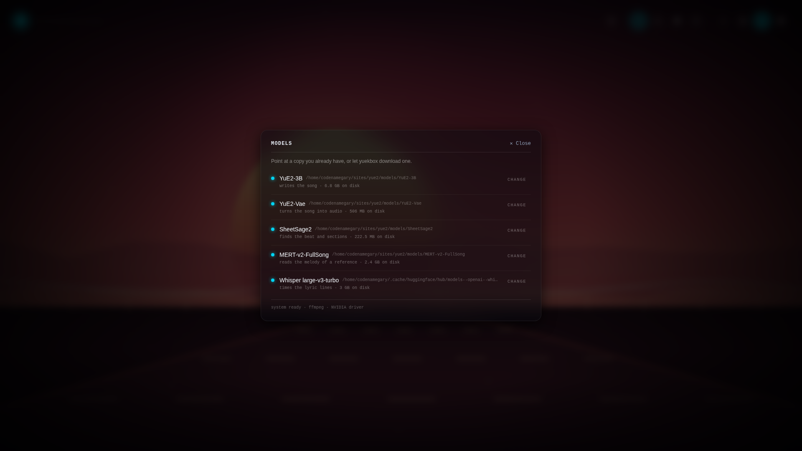

<div align="center">

# 🌀 YUEKBOX 🌀

### Because apparently GPUs are musicians now.

A local, single-user web app that turns **a style + some lyrics** into a **full song** with [YuE2](https://github.com/multimodal-art-projection/YuE) running on your machine. Just you, a graphics card, and increasingly questionable lyrics.


</div>

---

## ✨ WTF

I don't know man, nostalgia? Do you remember winamp? I do! Yuekbox harkens back
to those epic audio visualizer days, when you'd pop open ICQ and chat with somebody
half way around the world with your fire hazard of a lava lamp casting a dangerous glow
across your room, winamp blasting with some sick new visualizer on your CRT monitor
and Kazaa ripping viruses and REAL_NEW_EMINEM_FREE_NOT_FAKE.mp3 straight on to your
5400 RPM 10GB harddrive. So anyway I made this UI for Yue2, you type a vibe and some
words, hit the sparkle button, and watch the trip modes while a GPU in your house
lights on fire.

It is a **real app**, not a mockup. Under the AI skullduggery it's a Fastify server, a SQLite
queue, a worker, and the real YuE2 runtime. The visuals are just here to make the wait fun.

## 🎛️ What it does (v1)

- 🪞 **Two glass boxes.** One for style, one for lyrics, side by side.
- ✦ **Generate.** One click queues a Song and fires the worker.
- 🚦 **A queue, not a stampede.** Click generate ten times if you want. The GPU still runs one Song at a time.
- 📶 **Real progress.** Six stage pips, plus a hairline bar under them for the stages YuE2 actually counts (synthesize + decode). No fake bars for stages nobody can measure.
- 🔊 **Plays the MP3** when the Song lands, with a real spectrum fed by an `AnalyserNode`. The backdrop dances to it. Yes, really.
- ✍️ **Lyrics in the void.** While a Song plays, its lines fade in and out at the center of the page, timed to the notes actually sung in the rendered audio. Each line starts on its first note and stretches across held notes. Without a detection it falls back to the stored score. Each line settles in 0.4 s. The writer fades away until you pause.
- 🗂️ **History drawer.** Newest first. Click to play. Click to delete. Loading a song offers to replace the editor text before it stomps your draft.
- 🧪 **Keeps the score.** Every successful Song stores the ABC lead sheet for future features. v1 doesn't show it. Yet.
- ⌁ **Reference covers.** Attach a song file and SheetSage2 transcribes its melody first, then YuE2 sings your lyrics over that tune. Optional — without it you get the usual freeform generation.
- 📦 **A models panel.** The five model folders with their state and size. Download a model or point at a copy you already have; downloads over 128 MiB ask first, and a missing ffmpeg or NVIDIA driver shows its install line in the same panel.
- 🌈 **Four trip modes** for the background visualizer. More on that below.
- 🎨 **AI-authored backdrops.** With AI on, every new Song gets its own generated Canvas 2D visualization built from its style, its lyrics, and a randomly sampled visual direction, while the GPU is still working. It takes the backdrop over from the trip modes and owns the lyric display; reroll any Song whenever you like.
- 🧠 **Optional AI** that talks to any OpenAI-compatible endpoint — enhance, random, visualizations, full auto. Off by default. More below.

## 🖼️ Gallery

**Live progress**: the stage wheel spins through the pipeline while the pips light up per stage and the bar tracks real step counts from YuE2's stderr.


**AI visualizations**: with AI on, every new Song gets its own backdrop, built from its style and lyrics while the GPU works.


**Models**: download the five model files, or point yuekbox at copies you already have. The same panel reports ffmpeg and the NVIDIA driver when something is missing.



**History**: every song, its status, its duration, one click away.


**A considerate robot**: loading a song over a dirty editor asks first.


**Reference covers**: attach a song file and SheetSage2 transcribes its melody before YuE2 sings your lyrics over it.


## 🚀 Quick start

You need:

- 🐧 **Linux x86_64 or WSL2** with an **NVIDIA GPU** (16 GB VRAM works with the default budget; 24 GB is YuE2's stated recommendation) and an NVIDIA driver new enough for CUDA 12 (`525.60.13` or newer). macOS is not supported.
- 🎧 **ffmpeg** with `libmp3lame`. yuekbox checks for it at boot and tells you how to install it; it never installs it for you.
- 🧠 **The five model directories** — YuE2-3B, YuE2-Vae, SheetSage2, MERT-v2-FullSong, and Whisper large-v3-turbo. Download them from the app's models panel, or point yuekbox at copies you already have with `~/.yuekbox/config.yaml` or a CLI flag. Defaults live under `~/.yuekbox/models/<name>`.
- 🌐 **Network access** for `--provision` and any model downloads.
- 🥟 **[Bun](https://bun.sh) 1.4+** only to run from source. The released binary needs no Bun and no checkout.

Python is not on that list on purpose. `yuekbox --provision` builds the Python
runtime it needs under `~/.yuekbox`; you never install or name one.

### 📥 Install a release (no Bun, no checkout)

Every release attaches the `yuekbox-linux-x64` binary, its `.sha256` checksum,
and this installer. One line, on Linux or WSL2:

```bash
curl -fsSL https://github.com/codenamegary/yuekbox/releases/latest/download/install.sh | sh
```

On WSL2, or if you want to read the script before running it, download it and
run it:

```bash
curl -fsSL https://github.com/codenamegary/yuekbox/releases/latest/download/install.sh -o install.sh
sh install.sh
```

The installer checks the platform, downloads the binary and its checksum,
verifies SHA-256, and puts `yuekbox` in `~/.local/bin` (it prints the `PATH`
line when that directory is not on it). `YUEKBOX_INSTALL_DIR` moves the target
and `YUEKBOX_VERSION=v0.3.0` pins a release. Then:

```bash
yuekbox --provision   # one time: builds the Python runtime under ~/.yuekbox
yuekbox               # starts the app on http://127.0.0.1:3000
```

The binary bundles the UI, the API, the SQLite schema, and the Python helper
scripts. It does **not** bundle CUDA, PyTorch, Python, ffmpeg, or the model
weights. `--provision` builds the Python runtime under `~/.yuekbox`, and the
models come from the app's downloader or from copies you already have. It is
idempotent: if it stops on a missing driver or a dropped connection, fix that
and run it again, and the pieces already built are skipped.

### 🧰 Run from source

```bash
git clone https://github.com/codenamegary/yuekbox.git ui
cd ui
bun install
bun packages/server/src/server.ts --provision   # one time: builds the runtime under ~/.yuekbox
bun run dev
```

Open <http://127.0.0.1:3000> and go make something weird. The API hums along on
<http://127.0.0.1:8787>. Check its vitals with:

```bash
curl -s http://127.0.0.1:3000/v1/status
# fields: version, state, ffmpeg, yue2, sheetsage2, queueDepth, gpuBusy, startedAt
```

The exact response, defaults, and required fields are the `StatusSchema` in
[`packages/contracts/src/http/status.ts`](packages/contracts/src/http/status.ts).

### 📦 Single binary (no Bun or source tree at runtime)

The released `yuekbox-linux-x64` is this executable. CI builds it, smoke-tests
it, and attaches it to each GitHub release with its `.sha256` checksum. To build
the same file yourself:

```bash
bun run build:binary
./yuekbox
```

It serves the UI and the API on one port: <http://127.0.0.1:3000> (`WEB_PORT`
moves it). The first start extracts the Python helpers into
`~/.yuekbox/scripts`; `--home`, `--config`, `--yue2-model` and the other config
flags behave exactly as they do in dev. `--provision` is still the full setup
step (the Python environments and the helper scripts) and installs the same
helpers. The binary needs no `node_modules`, no source tree, and no Bun.

Cross-compile with `--target` and a local runtime:

```bash
bun run build:binary yuekbox-musl \
  --target bun-linux-x64-musl \
  --executable ~/.bun/install/cache/@oven/bun-linux-x64-musl@1.4.2@@@1/bin/bun
```

linux-x64 is the ship target. macos-arm64 is not supported: yuekbox wants a
local NVIDIA GPU. `scripts/smoke-binary.sh ./yuekbox` runs the compiled
acceptance smoke test locally; CI runs it on every PR. `sh scripts/install.test.sh`
exercises the release installer against a local HTTP server, and
[`docs/releasing.md`](docs/releasing.md) covers the release workflow and the
clean-machine install test.

Yuekbox keeps everything it manages in `~/.yuekbox` (`--home` moves it): the Python
runtimes under `tools/`, model defaults under `models/`, the Python environments under
`venvs/`, our scripts under `scripts/`, and the SQLite file plus Song media under `data/`.
The only thing you configure is where the five model files live:

```yaml
# ~/.yuekbox/config.yaml
models:
  yue2: /mnt/audio/YuE2-3B
  yue2Vae: /mnt/audio/YuE2-Vae
```

Keys you leave out fall back to `~/.yuekbox/models/<name>`. A CLI flag beats the file:
`yuekbox --yue2-model /mnt/audio/YuE2-3B` (or `bun packages/server/src/server.ts
--yue2-model /mnt/audio/YuE2-3B` from a checkout). `YUE2_KIT` is gone; yuekbox never
asks about a checkout.

### 🎼 Reference covers and the extra audio passes

Three optional pipelines ride along with a Song. `--provision` builds their
environments, and the five model directories come from the models panel (download one,
or point at a copy you already have).

**Reference covers** need [SheetSage2](https://huggingface.co/m-a-p/SheetSage2) and its
MERT-v2-FullSong base model. Attach a song file and SheetSage2 transcribes its melody
first; then YuE2 sings your lyrics over that tune. Attach a reference with either model
missing and the blocked-generation dialog asks for both (`sheetsage2` and
`sheetsage2Base`) before the Song starts. Without a reference, neither is needed.

**Lyric timing** comes from `packages/server/tools/lyric-align/align.py`: Demucs pulls
the vocal stem out of the rendered track, then Whisper writes word timestamps using the
`models.whisper` directory (download it in the models panel, or point it at a copy), and
a silence gate drops the words Whisper hallucinates over instrumental stretches. The
cues land in the Song's `calibration.json`, and the lyric overlay follows the transcript
as sung. A failed run logs and the Song still completes without cues.

**The measured analysis** comes from SheetSage2 running on the rendered audio: notes, a
beat grid, and section boundaries land in `analysis.json`, with the raw transcript tree
under `analysis/sheetsage2/`. The backdrop pulses on the measured downbeats, and an
AI-authored visual gets the analysis as its musical map. A failed run logs and the Song
still completes.

Source contributors: each tool has setup notes in its own folder
([`packages/server/tools/sheetsage2/README.md`](packages/server/tools/sheetsage2/README.md),
[`packages/server/tools/lyric-align/README.md`](packages/server/tools/lyric-align/README.md)),
and `spec.md` is the source of truth. The installed scripts live flat in
`~/.yuekbox/scripts/`; the SheetSage2 copy is vendored from YuE at the revision pinned in
`packages/server/src/runtime/runtime.pins.ts` (Apache-2.0). Uploads are capped at 25 MB
(`REFERENCE_MAX_BYTES`).

## 🤖 The "just make it work" prompt

Don't feel like reading setup docs? Paste this into Claude Code, Cursor, or any agent
with shell access to the GPU machine. The default path installs the release binary and
lets `--provision` build the Python side; a source checkout is included for contributors.

```text
Set up yuekbox on this machine and prove a song comes out. yuekbox is a local web
app that generates songs on the local GPU. Work through the steps in order and verify
each before moving on. Ask before downloading model weights (several GB).

Assumptions
- Linux or WSL2 with an NVIDIA GPU visible to `nvidia-smi`, driver 525.60.13 or newer.
- `curl` and `ffmpeg` are installed. ffmpeg must include libmp3lame; check with
  `ffmpeg -hide_banner -encoders | grep mp3`.
- Network access for the installer, `--provision`, and the model downloads.
- Python is not needed. `--provision` installs its own runtime under ~/.yuekbox.

1) Install the release binary (default path)
     curl -fsSL https://github.com/codenamegary/yuekbox/releases/latest/download/install.sh | sh
   Verify: `command -v yuekbox` prints a path. If the installer says the directory is
   not on PATH, run the export line it prints first.

2) Build the runtime (one time)
     yuekbox --provision
   It prints one plain-English line per piece and is resumable. On failure it says
   what to install or check; fix that and rerun.
   Verify: it exits 0 and ends with "yuekbox is ready."

3) Start the app
     yuekbox
   The web app and the API share http://127.0.0.1:3000.
   Verify: `curl -s http://127.0.0.1:3000/v1/status` answers with "state":"online" and
   "ffmpeg":"ok". The "yue2" field there is a boot-time check: it stays "missing" until
   the models exist and the app restarts. The models panel and
   `curl -s http://127.0.0.1:3000/v1/readiness` are the live picture.

4) Get the five models (ask me first)
   Open http://127.0.0.1:3000, click the models sigil (▤) in the top-right cluster, and
   for each row either download it or point it at a folder I already have. Downloads
   over 128 MiB ask for confirmation first.
   A freeform song needs YuE2-3B and YuE2-Vae; a reference cover also needs SheetSage2
   and MERT-v2-FullSong. Whisper large-v3-turbo never blocks a song, but download it to
   get lyric cues; without it the song completes without them.
   Verify: `curl -s http://127.0.0.1:3000/v1/readiness` shows each model you need as
   "ready".

5) Generate one song
   Enter a style and lyrics, press the sparkle button, wait for the pips, and confirm
   the player plays the MP3.
   The first generation after boot loads the model and takes a few minutes; later songs
   take roughly one to three minutes each.

Source checkout (contributors only; install Bun if it is missing with
`curl -fsSL https://bun.sh/install | bash`)
     git clone https://github.com/codenamegary/yuekbox.git ui
     cd ui
     bun install
     bun packages/server/src/server.ts --provision
     bun run dev
   The web app is at http://127.0.0.1:3000 and the API at http://127.0.0.1:8787; the
   model steps are the same.

Notes
- One Song runs on the GPU at a time; extra Generate clicks queue behind it.
- The server binds localhost only. Do not expose it.
- Model locations come from ~/.yuekbox/config.yaml or CLI flags; there is no YUE2_KIT.
- Do not commit anything. Report the /v1/status output, the song id, its duration, and
  any errors with stderr tails.
```

## 🧠 How it works

```text
packages/web        Bun.serve SPA + /v1 proxy, React 19, TanStack Query, Tailwind 4
packages/server     Fastify 5, Drizzle ORM, bun:sqlite, a single worker loop
packages/contracts  Zod wire schemas, paths, RFC 7807 problems
```

One worker claims the oldest `queued` Song, marks it `running`, and runs our
`~/.yuekbox/scripts/generate.py` with the YuE2 environment (the runtime that script
drives is pinned in `packages/server/src/runtime/runtime.pins.ts`). The runtime's stderr
is parsed live: known stage names move the pips, numeric lines move the progress bar.
Success means: encode the FLAC to MP3 with ffmpeg, run the `sync` passes — lyric-align
(Demucs + Whisper) writes the cues, SheetSage2 measures the rendered song — then write
the MP3, the ABC score, `calibration.json`, and `analysis.json` into the Song's own
folder under `MEDIA_DIR`, mark it `complete`, and delete the temp dir. A failed
alignment or analysis logs and leaves that file out; the Song still completes. A
generation or encode failure stores a short stderr tail and marks it `failed`. If the
server dies mid-run, the next boot confesses: `interrupted`.

Songs move through `queued → running → complete | failed`, and while running they carry
a `stage` (`transcribe`, `plan`, `semantic`, `synthesize`, `decode`, `encode`, `sync`) plus
`stageProgress` when YuE2 gives us numbers. Covers start at `transcribe`; freeform songs
start at `plan`. The web app polls, whoever is active updates fastest.

## 🧠 Bring your own model (optional)

AI is **off by default**, and the app behaves exactly as it always has until you
flip the switch in the settings sigil (⚙). Turn it on and Yuekbox talks to any
**OpenAI-compatible endpoint**: OpenAI, Anthropic, Gemini, OpenRouter, Groq,
Mistral, DeepSeek, Together — or whatever local thing you have running (Ollama,
LM Studio, vLLM). Pick a preset, adjust the base URL if you need to, add an API
key if the endpoint wants one, and choose a model from the endpoint's **live
`/models` listing**. Keys stay in the local SQLite file and are never echoed
back out of the API — only a `···abcd` hint.

With AI on, the boxes grow little sigils:

- **✧ enhance** on the style box sharpens the vibe you're pointing at.
- **✧ enhance** on the lyrics box extends and reworks what's there — or writes
  brand new lyrics when the box is empty.
- **⚄ random** has the model write a full new song and plays it.
- **∞ full auto** hides the inputs and runs the jukebox: always one song
  playing, always the next one generating. It never asks you anything.

Style, lyrics, and visuals each get their own endpoint, model, and optional
`reasoning_effort` (`off`, `low`, `medium`, `high` — only sent when not off).

The **visuals writer** authors one JavaScript canvas factory per Song, in parallel
with GPU generation. When it's configured, a selected Song with a visualization
hands the backdrop to it: the generated code gets the live audio spectrum and the
active lyric line and draw to a full-screen canvas. Reroll it from the player at
any time. If authoring fails — or the generated code throws — the trip mode
returns and a small badge offers a reroll; playback is never blocked.

## 🌌 The psychedelic bit

The whole visual layer is a port of the project's original redline mockup, and it is
deliberately, unapologetically **a screensaver that happens to make music**:

- 🌀 **Hyperspace Vortex** — Milkdrop-style concentric rings that breathe with the bass
- 〰️ **Phosphor Oscilloscope** — three ribbons of acid-green/violet waveform
- ❂ **Chromatic Plasma** — sixteen bands of hue-shifting interference
- ✧ **Quantum Stardust Vortex** — ninety particles orbiting a point that isn't there

**Contributions to this layer are extremely welcome.** Adding a fifth trip mode is
basically a one-function PR — see below. With AI on and the visuals writer
configured, a Song's own generated visualization takes the screen instead; the
trip modes are always the fallback.

## 🛠️ Contributing

Yuekbox is a fun project and contributions are **very** welcome. No contribution is
too small — a typo fix, a new trip mode, a bug report with a good screenshot, all of it counts.

### Ways to help

- 🌈 **Add a trip mode.** The background engine (`packages/web/src/songs/songs.winamp.engine.ts`) has one draw function per mode. Write a new one, add a sigil, done.
- 🎨 **Own the vibe.** Better typography, themes, a reduced-motion mode that keeps the soul but calms the visuals.
- 🐛 **Fix bugs.** Check the issues, or open one with the `/v1/status` output and a screenshot.
- 📝 **Write docs.** Especially real-world examples of styles/lyrics that work well.
- 🎼 **Future features.** ABC score viewing, chord edits, re-generating from a stored score — the data is already stored.

### The loop

1. 🍴 Fork and branch: `git checkout -b feat/my-thing`
2. 🥟 `bun install`
3. ⚙️ `bun packages/server/src/server.ts --provision` once, to build the Python side under `~/.yuekbox`
4. ✍️ Make the change
5. ✅ `bun run check` — lint, import boundaries, typecheck, tests. Keep it green.
6. 🚀 Open a PR. **Visual changes need visuals** — a screenshot or short clip. (The `docs/` stills were captured with a CDP-driven headed Chrome, if you want the same for yours.)

### House rules

- 🚫 No semicolons, no `any`, no classes, `const` only. oxlint + oxfmt enforce most of it; `bun run check` is the referee.
- 📦 Contracts first. New wire fields start in `packages/contracts`, never duplicated in the server.
- 🔌 Ports stay atomic. Use cases return `Result<T, E>` and never see Fastify or SQL.
- 🧪 Tests use inline stubs, not mocks. The GPU never runs in unit tests.
- 🎧 One Song on the GPU at a time. The queue is the feature.

### Reporting bugs

Include:

- the output of `curl -s http://127.0.0.1:3000/v1/status`
- what you expected vs. what happened
- if a generation failed: the Song id and its `errorDetail`
- if it's visual: a screenshot, and which trip mode you were in

### Etiquette

Be kind, assume good faith, and remember that this is a small app made for joy.
If a PR needs work, a maintainer will say so warmly and specifically.

## ⚙️ Home and config

yuekbox owns `~/.yuekbox` (override with `--home`):

```text
~/.yuekbox/
├── config.yaml           # the only user-editable file
├── tools/                # uv and the managed Python interpreters
├── models/<name>/        # the five model directories
├── venvs/<name>/         # Python environments: yue2, sheetsage2, lyricalign
├── scripts/              # generate.py, transcribe.py, abc_tools.py, common.py, align.py
└── data/                 # yuekbox.sqlite and per-Song media
```

The scripts are ours (source: `packages/server/tools/`). The script installer
(`packages/server/src/provisioning/`) copies them into `scripts/` flat and idempotently;
provisioning builds the environments around the runtime pinned in
`packages/server/src/runtime/runtime.pins.ts` and installs the interpreters under
`tools/`. The packaged binary embeds the same five files and extracts them into
`scripts/` on every start, so a fresh download needs no copy step.

The only thing you configure is where the five model files live. `config.yaml` is optional
and partial; unset keys fall back to `~/.yuekbox/models/<name>`:

| Config key | Model |
| --- | --- |
| `models.yue2` | YuE2-3B |
| `models.yue2Vae` | YuE2-Vae |
| `models.sheetsage2` | SheetSage2 |
| `models.sheetsage2Base` | MERT-v2-FullSong |
| `models.whisper` | Whisper large-v3-turbo |

A CLI flag beats the file: `--yue2-model`, `--yue2-vae`, `--sheetsage2`,
`--sheetsage2-base`, `--whisper`, plus `--home` and `--config`. `GET /v1/config` returns the
effective paths and `PUT /v1/config` writes partial `{ "models": { ... } }` updates. The
change lands live: readiness, downloads, and the next generation resolve the paths again
without a restart.

ffmpeg and the NVIDIA driver are machine prerequisites, not settings. Readiness detects
them and, when one is missing, shows the install command for Linux and WSL2 instead of a
config row.

Server and runtime overrides (advanced; everything else under the home is internal):

| Name | Default | Purpose |
| --- | --- | --- |
| `HOST` | `127.0.0.1` | Fastify bind address (dev) |
| `PORT` | `8787` | Fastify port (dev) |
| `WEB_HOST` | `127.0.0.1` | SPA listener bind address (dev and binary) |
| `WEB_PORT` | `3000` | SPA listener port (dev and binary) |
| `API_ORIGIN` | `http://127.0.0.1:8787` | Fastify origin the dev web server's `/v1` proxy forwards to |
| `SQLITE_PATH` | `~/.yuekbox/data/yuekbox.sqlite` | SQLite file |
| `MEDIA_DIR` | `~/.yuekbox/data/media` | Per-Song folders: `generated_<songId>.mp3`, `score.abc`, `calibration.json`, `analysis.json`, `analysis/sheetsage2/`, `reference_score.abc`, `visualization.js`, `references/<name>_<ulid>.<ext>`; uploads land in `temp/` |
| `FFMPEG_BIN` | `ffmpeg` | Encoder binary |
| `YUE2_PYTHON` | `~/.yuekbox/venvs/yue2/bin/python` | YuE2 environment interpreter |
| `YUE2_GPU_BUDGET` | `16` | GPU memory budget in GiB, passed to `generate.py` |
| `SHEETSAGE2_PYTHON` | `~/.yuekbox/venvs/sheetsage2/bin/python` | SheetSage2 environment interpreter |
| `SHEETSAGE2_SCRIPT` | `~/.yuekbox/scripts/transcribe.py` | SheetSage2 entrypoint |
| `SHEETSAGE2_DEVICE` | `cuda` | Torch device for SheetSage2 |
| `SHEETSAGE2_OFFLINE` | on | Set `0` to let Hugging Face resolve and download through its cache |
| `LYRIC_ALIGN_PYTHON` | `~/.yuekbox/venvs/lyricalign/bin/python` | lyric-align environment interpreter |
| `LYRIC_ALIGN_SCRIPT` | `~/.yuekbox/scripts/align.py` | lyric-align entrypoint |
| `LYRIC_ALIGN_DEVICE` | `cuda:0` | Torch device for the aligner |
| `REFERENCE_MAX_BYTES` | `26214400` (25 MiB) | Upload cap for reference audio |

In the packaged binary the API binds an OS-assigned loopback port, so `HOST` and
`PORT` apply to the dev server only; `WEB_HOST`/`WEB_PORT` are the public listener.
`generate.py` always comes from `<home>/scripts/generate.py`; there is no override for it.

## 🧰 Scripts

| Command | Does |
| --- | --- |
| `bun run dev` | Fastify (:8787) and the web app (:3000) in parallel |
| `bun run check` | Lint, import boundaries, typecheck, and tests across all packages |
| `bun run test` | `bun test` per package |
| `bun run build:binary` | Compile the single `./yuekbox` executable |
| `sh scripts/install.test.sh` | Installer test against a throwaway HTTP server |
| `bash scripts/release-notes.test.sh` | Release-note append test with a `gh` shim |
| `bun run db:generate <name>` | Drizzle migration from the schema |
| `bun run format` / `format:check` | oxfmt |

## 🔌 API sketch

- `POST /v1/songs` — body `{ lyrics, style, referenceId?, seed? }`, `201` and the Song; `409 model-required` names any missing models first.
- `GET /v1/songs` — newest first, keyset cursor, optional repeated `status`.
- `GET /v1/songs/:songId` — one Song; carries `scoreAbc` and `calibration` when complete.
- `GET /v1/songs/:songId/audio` — `audio/mpeg` with Range support; `409` before completion.
- `DELETE /v1/songs/:songId` — `204`.
- `POST /v1/references?filename=…` — the audio upload a reference cover attaches, capped at `REFERENCE_MAX_BYTES`.
- `GET /v1/songs/:songId/visualization` — `{ visualization, analysis }`; the visual is null, `pending`, `ready`/`rerolling` with code and checksum, or `failed`.
- `POST /v1/songs/:songId/visualization` — reroll the AI canvas; `202`, `409` when the visuals writer is not ready.
- `GET /v1/status` — version, state, `ffmpeg`, `yue2`, `sheetsage2`, `queueDepth`, `gpuBusy`, `startedAt`.
- `GET /v1/readiness` — the five models (state, resolved path, size) plus the ffmpeg and NVIDIA preflight.
- `GET /v1/models/downloads` — the five download snapshots.
- `GET` / `POST /v1/models/:key/download` — one snapshot; `POST` starts or resumes a download.
- `GET` / `PUT /v1/config` — the five model paths; `PUT` writes `~/.yuekbox/config.yaml`.
- `GET /v1/ai/presets` — known OpenAI-compatible endpoints and icons.
- `GET` / `PUT /v1/ai/config` — AI settings; API keys are write-only.
- `GET /v1/ai/models?scope=style|lyrics|visuals` — live model list from that endpoint.
- `POST /v1/ai/enhance` — `{ kind, style?, lyrics? }` → `{ text }`.
- `POST /v1/ai/songs/random` — the model writes a Song, the queue runs it.

## 📜 License

Yuekbox is released under the [MIT License](LICENSE). Take it, fork it, remix it, ship it.

YuE2 model weights and the pinned Python runtime are separate projects and are **not**
covered by this license; the five model repositories and the runtime carry their own terms
from their upstream projects, starting with the
[YuE project](https://github.com/multimodal-art-projection/YuE).

---

<div align="center">

Made for headphones, late nights, and GPUs that deserve better than spreadsheets. 🎧🌙

**Go make something weird.**

</div>
