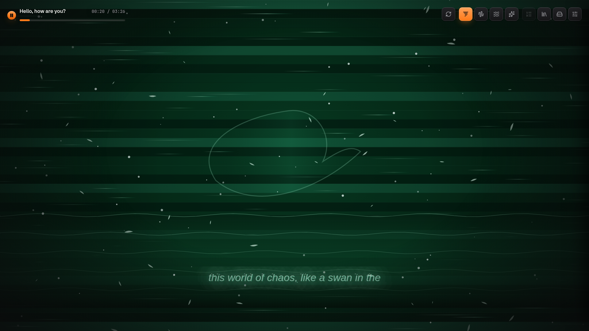
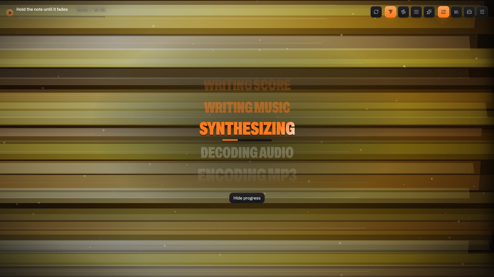
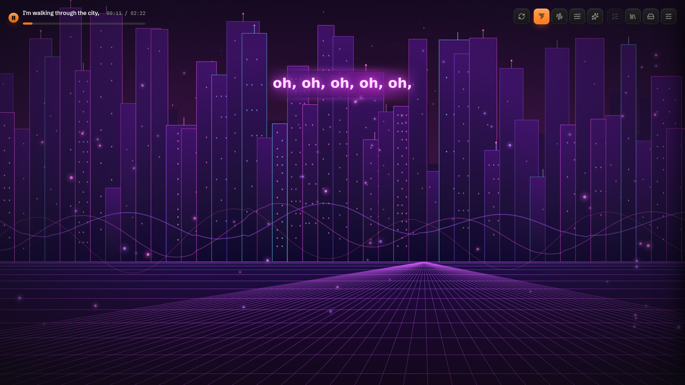
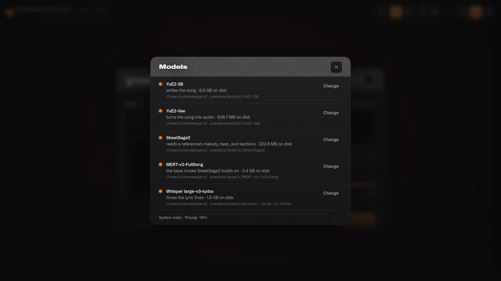
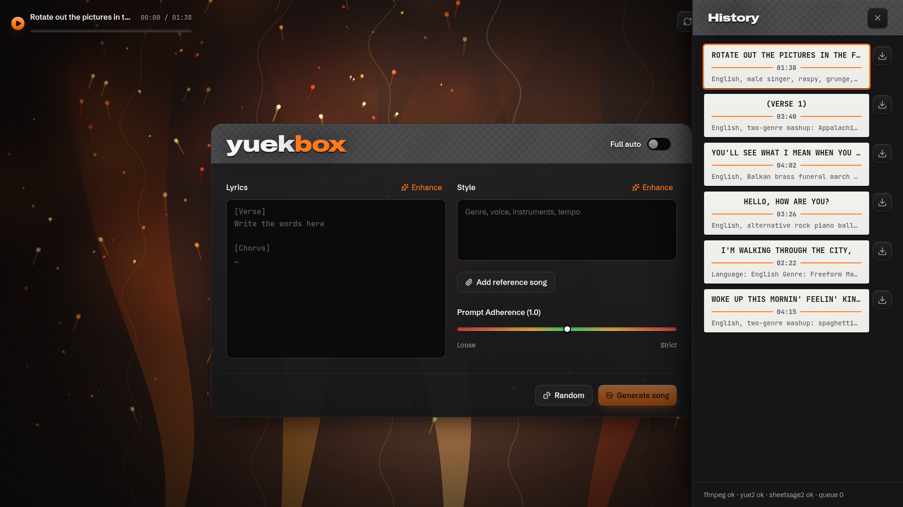
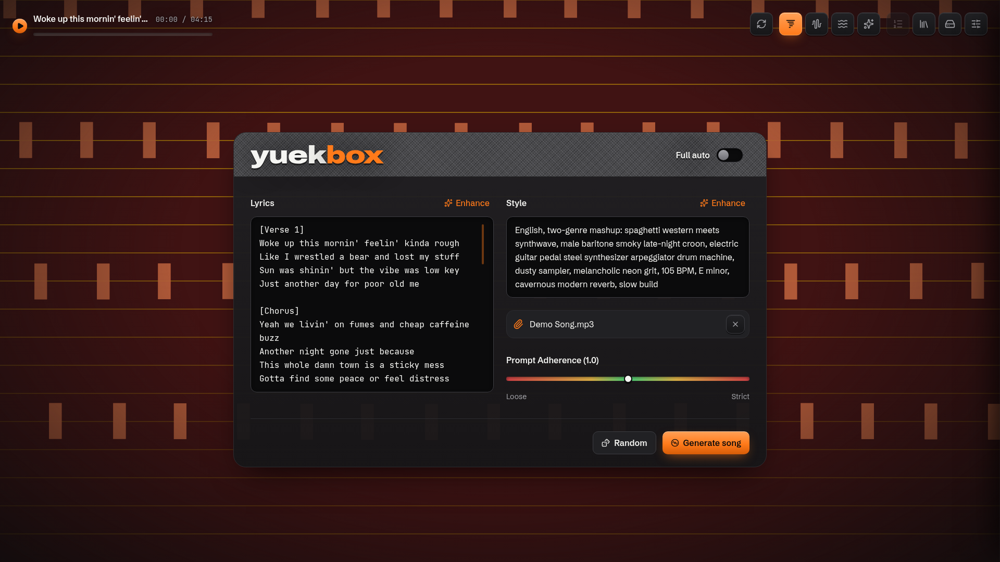

<div align="center">

# 🌀 YUEKBOX 🌀

### Because apparently GPUs are musicians now.

Just you, a graphics card, and increasingly questionable lyrics.

</div>



### 👇 Install for Linux & Mac

Requires [Bun](https://bun.sh) 1.4.2 or newer on your `PATH`, then:

```bash
npm i -g yuekbox
```

Or take it for one spin without installing:

```bash
npx yuekbox
```

## ✨ WTF

I don't know man, nostalgia? Do you remember winamp? I do! Yuekbox harkens back
to those epic audio visualizer days, when you'd pop open ICQ and chat with somebody
half way around the world with your fire hazard of a lava lamp casting a dangerous glow
across your room, winamp blasting with some sick new visualizer on your CRT monitor
and Kazaa ripping viruses and REAL_NEW_EMINEM_FREE_NOT_FAKE.mp3 straight on to your
5400 RPM 10GB harddrive. So anyway I made this UI for Yue2, you type a vibe and some
words, hit the sparkle button, and watch the visualizer while a GPU in your house
lights on fire.

## 🎛️ What it does

- 📻 **Music** You or the AI provide the lyrics and style, Yue2 generates the music. Never touches the cloud.
- ⌁ **Reference covers.** Attach a song file and SheetSage2 transcribes its melody first, then YuE2 takes some liberties and generates a variation. Optional. Without it you get the usual freeform generation.
- 🎨 **AI-authored visualizer.** With AI enabled, every new Song gets its own generated Canvas 2D visualization built from its style, its lyrics, and a randomly sampled visual direction. Reroll a new visualizer for any Song whenever you like.
- 😌 **Bliss Mode** that talks to any OpenAI-compatible endpoint: random songs, visualizations, full auto, will play until your GPU burns your house down.

## 🖼️ Gallery

**Live progress**: the stage wheel spins through the pipeline.



**AI visualizations**: with AI on, every new Song gets its own reactive visualizer, built from its style and lyrics.



**Models**: download the five model files, or point yuekbox at copies you already have.



**History**: every song, one click away.



**Reference covers**: attach a song file and SheetSage2 transcribes its melody so YuE2 can cover it.



## 🚀 Quick start

You need:

- 🐧 **Linux or Mac** with an **NVIDIA GPU** (16 GB VRAM works with the default budget. 24 GB is YuE2's stated recommendation) and an NVIDIA driver new enough for CUDA 12 (`525.60.13` or newer), **or** 🍎 a **Mac with Apple Silicon** (M1 or newer, macOS 14.2+, 16 GB unified memory minimum — 32 GB is comfortable). On the Mac, generation runs on the GPU through the MLX port of the same YuE2 stack, no NVIDIA anything required.
- 🎧 **ffmpeg** with `libmp3lame`. yuekbox checks for it at boot and tells you how to install it. It never installs it for you.
- 🧠 **The five model directories**: YuE2-3B, YuE2-Vae, SheetSage2, MERT-v2-FullSong, and Whisper large-v3-turbo. Download them from the app's models panel, or point yuekbox at copies you already have with `~/.yuekbox/config.yaml` or a CLI flag. Defaults live under `~/.yuekbox/models/<name>`. The platform picks the right pinned revisions automatically (the Mac downloads the pre-converted MLX weights).
- 🌐 **Network access** for `--provision` and any model downloads.
- 🥟 **[Bun](https://bun.sh) 1.4.2 or newer**, on your `PATH`. The package runs on Bun; there is no separate binary anymore.

Python is not on that list on purpose. `yuekbox --provision` builds the Python
runtime it needs under `~/.yuekbox`. You never install or name one.

### 📥 Install a release

```bash
npm i -g yuekbox      # or: npx yuekbox to try it without installing
yuekbox --provision   # one time: builds the Python runtime under ~/.yuekbox
yuekbox               # starts the app in the background and returns to the prompt
```

Every release is also the npm package `yuekbox`, published from CI with
provenance you can verify on npmjs.com. The package bundles the UI, the API,
the SQLite schema, and the Python helper scripts. It does **not** bundle CUDA,
PyTorch, Python, ffmpeg, or the model weights. `--provision` builds the Python
runtime under `~/.yuekbox`, and the models come from the app's downloader or
from copies you already have.

### 🧰 Run from source

```bash
git clone https://github.com/codenamegary/yuekbox.git ui
cd ui
bun install
bun packages/server/src/server.ts --provision   # one time: builds the runtime under ~/.yuekbox
bun run dev
```

Open <http://127.0.0.1:3000> and go make something weird. Check API vitals with:

```bash
curl -s http://127.0.0.1:3000/v1/status
# fields: version, state, ffmpeg, yue2, sheetsage2, queueDepth, gpuBusy, startedAt
```

The exact response, defaults, and required fields are the `StatusSchema` in
[`packages/contracts/src/http/status.ts`](packages/contracts/src/http/status.ts).

### 📦 The npm package

The released package is the same thing `npm i -g yuekbox` installs. CI builds
it, packs it, smoke-tests the packed tarball on Linux and on a macOS arm64
runner, then publishes it with provenance (the npmjs page shows the workflow
and commit behind every version). To build the same tarball yourself:

```bash
bun run build:package
(cd dist/yuekbox && npm pack)
```

It serves the UI and the API on one port: <http://127.0.0.1:3000> (or set `WEB_PORT`
yourself). `start` detaches: the command returns to the prompt and the daemon
keeps running (see [Managing yuekbox](#-managing-yuekbox-start-stop-status-uninstall)).
The first start extracts the Python helpers into `~/.yuekbox/scripts`.
`--home`, `--config`, `--yue2-model` and the other config flags behave exactly
as they do in dev. `--provision` is still the full setup step (the Python
environment and the helper scripts), runs attached, and exits when done. The
package needs no `node_modules` and no source tree — just Bun.

`scripts/smoke-package.sh` runs the packed-tarball acceptance smoke test
locally. CI runs it on every PR, and the release workflow runs it on
ubuntu-latest and a macOS arm64 runner before publishing.
exercises the release installer against a local HTTP server, and
[`docs/releasing.md`](docs/releasing.md) covers the release workflow and the
clean-machine install test. The Apple Silicon acceptance bench
(`darwin-verify.yml`) provisions and generates one Song end to end in CI. Run
it before publishing a release that touched the macOS paths or a runtime pin.

Yuekbox keeps everything it manages in `~/.yuekbox` (or `--home` if you want to put it elsewhere): the Python
runtime under `tools/`, model defaults under `models/`, the Python environment under
`venvs/`, our scripts under `scripts/`, and the SQLite file plus Song media under `data/`.
The only thing you configure is where the five model files live:

```yaml
# ~/.yuekbox/config.yaml
models:
  yue2: /mnt/audio/YuE2-3B
  yue2Vae: /mnt/audio/YuE2-Vae
```

Keys you leave out fall back to `~/.yuekbox/models/<name>`. A CLI flag beats the file:
`yuekbox --yue2-model /mnt/audio/YuE2-3B` (or `bun packages/server/src/server.ts --yue2-model /mnt/audio/YuE2-3B` from a checkout). yuekbox never asks about a checkout.

### 🕹️ Managing yuekbox (start, stop, status, uninstall)

The binary manages its own life. One instance per home; `--home` selects which.
Bare `yuekbox` means `start`.

```bash
yuekbox start     # detach: prints the pid, URL, and log path, then returns
yuekbox status    # running? pid, url, uptime, and a one-line service summary
yuekbox stop      # SIGTERM, wait up to 10 s, SIGKILL: when it returns, it is gone
yuekbox uninstall # asks what to remove: the binary, the app data, the models
```

`status --json` prints the same verdict as machine-readable JSON
(`{"state":"running","pid":...}`), exit code 0 running, 3 stopped. `start` is
idempotent: starting twice reports the running pid and spawns nothing.
`uninstall` prompts on a terminal — the binary defaults yes, app data and
models default no — and `uninstall --purge` removes the binary and the whole
home without asking. Model folders you point `config.yaml` at outside the home
are never touched.

Whether yuekbox is running is decided by an exclusive lock at
`~/.yuekbox/run/yuekbox.lock`, so a crashed instance can never leave a stale
"running" answer behind. The daemon writes `~/.yuekbox/run/yuekbox.json` (pid,
URL, log) once it is actually serving, and appends its output to
`~/.yuekbox/logs/yuekbox.log` — `tail -f` that file to watch a boot or a
generation.

```text
yuekbox status
yuekbox is running (pid 1234)
  url       http://127.0.0.1:3000
  home      /home/you/.yuekbox
  version   0.4.0
  uptime    12m 4s
  log       /home/you/.yuekbox/logs/yuekbox.log
  service   online · queue 2 · gpu busy · ffmpeg ok · yue2 ok
```

### 🎼 Reference covers and the extra audio passes

Three optional pipelines ride along with a Song, all sharing the one environment
`--provision` builds. The five model directories come from the models panel (download
one, or point at a copy you already have).

**Reference covers** need [SheetSage2](https://huggingface.co/m-a-p/SheetSage2) and its
MERT-v2-FullSong base model. Attach a song file and SheetSage2 transcribes its melody
first. Then YuE2 sings your lyrics over that tune. Attach a reference with either model
missing and the blocked-generation dialog asks for both (`sheetsage2` and
`sheetsage2Base`) before the Song starts. Without a reference, neither is needed.

**Lyric timing** comes from `packages/server/tools/lyric-align/align.py`: Demucs pulls
the vocal stem out of the rendered track, then Whisper writes word timestamps using the
`models.whisper` directory (download it in the models panel, or point it at a copy), and
a silence gate drops the words Whisper hallucinates over instrumental stretches. The
cues land in the Song's `calibration.json`, and the lyric overlay follows the transcript
as sung. A failed run logs and the Song still completes without cues.

**The measured analysis** comes from SheetSage2 running on the rendered audio: notes, a
beat grid, and section boundaries land in `analysis.json`, with the raw transcript tree
under `analysis/sheetsage2/`. The backdrop pulses on the measured downbeats, and an
AI-authored visual gets the analysis as its musical map. A failed run logs and the Song
still completes.

Source contributors: each tool has setup notes in its own folder
([`packages/server/tools/sheetsage2/README.md`](packages/server/tools/sheetsage2/README.md),
[`packages/server/tools/lyric-align/README.md`](packages/server/tools/lyric-align/README.md)),
and `spec.md` is the source of truth. The installed scripts live flat in
`~/.yuekbox/scripts/`. The SheetSage2 copy is vendored from YuE at the revision pinned in
`packages/server/src/runtime/runtime.pins.ts`. Uploads are capped at 25 MB
(`REFERENCE_MAX_BYTES`).

## 🤖 The "just make it work" prompt

Don't feel like reading setup docs? Paste this into Claude Code, Cursor, or any agent
with shell access to the GPU machine. The default path installs the npm package and
lets `--provision` build the Python side. A source checkout is included for contributors.

```text
Set up yuekbox on this machine and prove a song comes out. yuekbox is a local web
app that generates songs on the local GPU. Work through the steps in order and verify
each before moving on. Ask before downloading model weights (several GB).

Assumptions
- Linux or WSL2 with an NVIDIA GPU visible to `nvidia-smi`, driver 525.60.13 or newer, or a Mac with Apple silicon.
- [Bun](https://bun.sh) 1.4.2+ and `ffmpeg` are installed. ffmpeg must include
  libmp3lame. Check with `ffmpeg -hide_banner -encoders | grep mp3`.
- Network access for `--provision` and the model downloads.
- Python is not needed. `--provision` installs its own runtime under ~/.yuekbox.

1) Install the package (default path)
     npm i -g yuekbox
   Verify: `command -v yuekbox` prints a path. If it prints nothing, Bun is
   missing or not on PATH: install it from bun.sh first.

2) Build the runtime (one time)
     yuekbox --provision
   It prints one plain-English line per piece and is resumable. On failure it says
   what to install or check. Fix that and rerun.
   Verify: it exits 0 and ends with "yuekbox is ready."

3) Start the app
     yuekbox
   The web app and the API share http://127.0.0.1:3000. The command detaches and
   returns to the prompt; the daemon keeps running in the background.
   Verify: `yuekbox status` says running, and
   `curl -s http://127.0.0.1:3000/v1/status` answers with "state":"online" and
   "ffmpeg":"ok". The "yue2" field there is a boot-time check: it stays "missing" until
   the models exist and the app restarts. The models panel and
   `curl -s http://127.0.0.1:3000/v1/readiness` are the live picture. The daemon
   log is ~/.yuekbox/logs/yuekbox.log if anything looks wrong.

4) Get the five models (ask me first)
   Open http://127.0.0.1:3000, click the models sigil (▤) in the top-right cluster, and
   for each row either download it or point it at a folder I already have. A download
   starts only when its button is pressed, so nothing downloads on its own.
   A freeform song needs YuE2-3B and YuE2-Vae. A reference cover also needs SheetSage2
   and MERT-v2-FullSong. Whisper large-v3-turbo never blocks a song, but download it to
   get lyric cues. Without it the song completes without them.
   Verify: `curl -s http://127.0.0.1:3000/v1/readiness` shows each model you need as
   "ready".

5) Generate one song
   Enter a style and lyrics, press the sparkle button, wait for the pips, and confirm
   the player plays the MP3.
   The first generation after boot loads the model and takes a few minutes. Later songs
   take roughly one to three minutes each.

Source checkout (contributors only. Install Bun if it is missing with
`curl -fsSL https://bun.sh/install | bash`)
     git clone https://github.com/codenamegary/yuekbox.git ui
     cd ui
     bun install
     bun packages/server/src/server.ts --provision
     bun run dev
   The web app is at http://127.0.0.1:3000 and the API at http://127.0.0.1:8787. The
   model steps are the same.

Notes
- One Song runs on the GPU at a time. Extra Generate clicks queue behind it.
- The server binds localhost only. Do not expose it.
- The binary manages itself: `yuekbox status`, `yuekbox stop`,
  `yuekbox uninstall --purge` when you want it gone. Its log is
  ~/.yuekbox/logs/yuekbox.log.
- Model locations come from ~/.yuekbox/config.yaml or CLI flags.
- Do not commit anything. Report the /v1/status output, the song id, its duration, and
  any errors with stderr tails.
```

## 🧠 Internals

```text
packages/web        Bun.serve SPA + /v1 proxy, React 19, TanStack Query, Tailwind 4
packages/server     Fastify 5, Drizzle ORM, bun:sqlite, a single worker loop
packages/contracts  Zod wire schemas, paths
```

One worker claims the oldest `queued` Song, marks it `running`, and runs our
`~/.yuekbox/scripts/generate.py` with the YuE2 environment (the runtime that script
drives is pinned in `packages/server/src/runtime/runtime.pins.ts`). The runtime's stderr
is parsed live: known stage names move the pips, numeric lines move the progress bar.
Success means: encode the FLAC to MP3 with ffmpeg, run the `sync` passes. Lyric-align
(Demucs + Whisper) writes the cues, SheetSage2 measures the rendered song, then the run writes
the MP3, the ABC score, `calibration.json`, and `analysis.json` into the Song's own
folder under `MEDIA_DIR`, mark it `complete`, and delete the temp dir. A failed
alignment or analysis logs and leaves that file out. The Song still completes. A
generation or encode failure stores a short stderr tail and marks it `failed`. If the
server dies mid-run, the next boot confesses: `interrupted`.

Songs move through `queued → running → complete | failed`, and while running they carry
a `stage` (`transcribe`, `plan`, `semantic`, `synthesize`, `decode`, `encode`, `sync`) plus
`stageProgress` when YuE2 gives us numbers. Covers start at `transcribe`. Freeform songs
start at `plan`. The web app polls, whoever is active updates fastest.

## 🧠 Bring your own model (optional)

AI for lyrics, style and visualization is **off by default**, and the app behaves exactly as it always has until you
flip the switch in the settings sigil (⚙). Turn it on and Yuekbox talks to any
**OpenAI-compatible endpoint**: OpenAI, Anthropic, Gemini, OpenRouter, Groq,
Mistral, DeepSeek, Together, or whatever local thing you have running (Ollama,
LM Studio, vLLM). Pick a preset, adjust the base URL if you need to, add an API
key if the endpoint wants one, and choose a model from the endpoint's **live
`/models` listing**. Keys stay in the local SQLite file and are never echoed
back out of the API. Only a `···abcd` hint.

With AI on, the boxes grow little sigils:

- **✧ enhance** on the style box sharpens the vibe you're pointing at.
- **✧ enhance** on the lyrics box extends and reworks what's there, or writes
  brand new lyrics when the box is empty.
- **⚄ random** has the model write a full new song and plays it.
- **∞ full auto** hides the inputs and runs the jukebox: always one song
  playing, always the next one generating. It never asks you anything.

Style, lyrics, and visuals each get their own endpoint, model, and optional
`reasoning_effort` (`off`, `low`, `medium`, `high`, only sent when not off).

The **visuals writer** authors one JavaScript canvas factory per Song, in parallel
with GPU generation. When it's configured, a selected Song with a visualization
hands the backdrop to it: the generated code gets the live audio spectrum and the
active lyric line and draw to a full-screen canvas. Reroll it from the player at
any time.

## 🌌 The psychedelic bit

The whole visual layer is a port of the project's original redline mockup, and it is
deliberately, unapologetically **a screensaver that happens to make music**:

- 🌀 **Hyperspace Vortex**: Milkdrop-style concentric rings that breathe with the bass
- 〰️ **Phosphor Oscilloscope**: three ribbons of acid-green/violet waveform
- ❂ **Chromatic Plasma**: sixteen bands of hue-shifting interference
- ✧ **Quantum Stardust Vortex**: ninety particles orbiting a point that isn't there

**Contributions to this layer are extremely welcome.** Adding a visualizer is
basically a one-function PR. See below. With AI on and the visuals writer
configured, a Song's own generated visualization takes the screen instead. The
built-in visualizers are always the fallback.

## 🛠️ Contributing

Yuekbox is a fun project and contributions are **very** welcome. No contribution is
too small. A typo fix, a new visualizer, a bug report with a good screenshot, all of it counts.

### Ways to help

- 🌈 **Add a visualizer.** The background engine (`packages/web/src/songs/songs.winamp.engine.ts`) has one draw function per visualizer. Write a new one, add a sigil, done.
- 🎨 **Own the vibe.** Better typography, themes, a reduced-motion mode that keeps the soul but calms the visuals.
- 🐛 **Fix bugs.** Check the issues, or open one with the `/v1/status` output and a screenshot.
- 📝 **Write docs.** Especially real-world examples of styles/lyrics that work well.
- 🎼 **Future features.** ABC score viewing, chord edits, re-generating from a stored score. The data is already stored.

### The loop

1. 🍴 Fork and branch: `git checkout -b feat/my-thing`
2. 🥟 `bun install`
3. ⚙️ `bun packages/server/src/server.ts --provision` once, to build the Python side under `~/.yuekbox`
4. ✍️ Make the change
5. ✅ `bun run check`: lint, import boundaries, typecheck, tests. Keep it green.
6. 🚀 Open a PR. **Visual changes need visuals**: a screenshot or short clip.

### House rules

- 🚫 No semicolons, no `any`, no classes, `const` only. oxlint + oxfmt enforce most of it. `bun run check` is the referee.
- 📦 Contracts first. New wire fields start in `packages/contracts`, never duplicated in the server.
- 🔌 Ports stay atomic. Use cases return `Result<T, E>` and never see Fastify or SQL.
- 🧪 Tests use inline stubs, not mocks. The GPU never runs in unit tests.
- 🎧 One Song on the GPU at a time. The queue is the feature.

### Reporting bugs

Include:

- the output of `curl -s http://127.0.0.1:3000/v1/status`
- what you expected vs. what happened
- if a generation failed: the Song id and its `errorDetail`, plus whatever logs you have in `~/.yuekbox`

### Etiquette

Be kind, assume good faith, and remember that this is a small app made for joy.
If a PR needs work, a maintainer will say so warmly and specifically.

## ⚙️ Home and config

yuekbox owns `~/.yuekbox` (override with `--home`):

```text
~/.yuekbox/
├── config.yaml           # the only user-editable file
├── tools/                # uv and the managed Python interpreter
├── models/<name>/        # the five model directories
├── venvs/python/         # the one shared Python environment
├── scripts/              # generate.py, transcribe.py, abc_tools.py, common.py, align.py
└── data/                 # yuekbox.sqlite and per-Song media
```

The scripts are ours (source: `packages/server/tools/`). The script installer
(`packages/server/src/provisioning/`) copies them into `scripts/` flat and idempotently,
provisioning builds one shared environment around the runtime pinned in
`packages/server/src/runtime/runtime.pins.ts` and installs the interpreter under
`tools/`. The packaged binary embeds the same five files and extracts them into
`scripts/` on every start, so a fresh download needs no copy step.

The only thing you configure is where the five model files live. `config.yaml` is optional
and partial. Unset keys fall back to `~/.yuekbox/models/<name>`:

| Config key | Model |
| --- | --- |
| `models.yue2` | YuE2-3B |
| `models.yue2Vae` | YuE2-Vae |
| `models.sheetsage2` | SheetSage2 |
| `models.sheetsage2Base` | MERT-v2-FullSong |
| `models.whisper` | Whisper large-v3-turbo |

A CLI flag beats the file: `--yue2-model`, `--yue2-vae`, `--sheetsage2`,
`--sheetsage2-base`, `--whisper`, plus `--home` and `--config`. `GET /v1/config` returns the
effective paths and `PUT /v1/config` writes partial `{ "models": { ... } }` updates. The
change lands live: readiness, downloads, and the next generation resolve the paths again
without a restart.

ffmpeg and the NVIDIA driver are machine prerequisites, not settings. Readiness detects
them and, when one is missing, shows the install command for Linux and WSL2 instead of a
config row.

Server and runtime overrides (advanced. Everything else under the home is internal):

| Name | Default | Purpose |
| --- | --- | --- |
| `HOST` | `127.0.0.1` | Fastify bind address (dev) |
| `YUEKBOX_PYTHON` | `~/.yuekbox/venvs/python/bin/python` | One shared interpreter for every Python pass |
| `PORT` | `8787` | Fastify port (dev) |
| `WEB_HOST` | `127.0.0.1` | SPA listener bind address (dev and binary) |
| `WEB_PORT` | `3000` | SPA listener port (dev and binary) |
| `API_ORIGIN` | `http://127.0.0.1:8787` | Fastify origin the dev web server's `/v1` proxy forwards to |
| `SQLITE_PATH` | `~/.yuekbox/data/yuekbox.sqlite` | SQLite file |
| `MEDIA_DIR` | `~/.yuekbox/data/media` | Per-Song folders: `generated_<songId>.mp3`, `score.abc`, `calibration.json`, `analysis.json`, `analysis/sheetsage2/`, `reference_score.abc`, `visualization.js`, `references/<name>_<ulid>.<ext>`. Uploads land in `temp/` |
| `FFMPEG_BIN` | `ffmpeg` | Encoder binary |
| `YUE2_GPU_BUDGET` | `16` | GPU memory budget in GiB, passed to `generate.py` |
| `SHEETSAGE2_SCRIPT` | `~/.yuekbox/scripts/transcribe.py` | SheetSage2 entrypoint |
| `SHEETSAGE2_DEVICE` | `cuda` | Torch device for SheetSage2 |
| `SHEETSAGE2_OFFLINE` | `1` | Set `0` to let Hugging Face resolve and download through its cache |
| `LYRIC_ALIGN_SCRIPT` | `~/.yuekbox/scripts/align.py` | lyric-align entrypoint |
| `LYRIC_ALIGN_DEVICE` | `cuda:0` | Torch device for the aligner |
| `REFERENCE_MAX_BYTES` | `26214400` (25 MiB) | Upload cap for reference audio |

In the packaged binary the API binds an OS-assigned loopback port, so `HOST` and
`PORT` apply to the dev server only. `WEB_HOST`/`WEB_PORT` are the public listener.
`generate.py` always comes from `<home>/scripts/generate.py`. There is no override for it.

## 🧰 Scripts

| Command | Does |
| --- | --- |
| `bun run dev` | Fastify (:8787) and the web app (:3000) in parallel |
| `bun run check` | Lint, import boundaries, typecheck, and tests across all packages |
| `bun run test` | `bun test` per package |
| `bun run build:package` | Build the publishable npm package into `dist/yuekbox` |
| `./scripts/smoke-package.sh` | Packed-tarball smoke test against a scratch global install |
| `bash scripts/release-notes.test.sh` | Release-note append test with a `gh` shim |
| `bun run db:generate <name>` | Drizzle migration from the schema |
| `bun run format` / `format:check` | oxfmt |

## 🔌 API sketch

- `POST /v1/songs`: body `{ lyrics, style, referenceId?, seed? }`, `201` and the Song. `409 model-required` names any missing models first.
- `GET /v1/songs`: newest first, keyset cursor, optional repeated `status`.
- `GET /v1/songs/:songId`: one Song. Carries `scoreAbc` and `calibration` when complete.
- `GET /v1/songs/:songId/audio`: `audio/mpeg` with Range support. `409` before completion.
- `DELETE /v1/songs/:songId`: `204`.
- `POST /v1/references?filename=…`: the audio upload a reference cover attaches, capped at `REFERENCE_MAX_BYTES`.
- `GET /v1/songs/:songId/visualization`: `{ visualization, analysis }`. The visual is null, `pending`, `ready`/`rerolling` with code and checksum, or `failed`.
- `POST /v1/songs/:songId/visualization`: reroll the AI canvas. `202`, `409` when the visuals writer is not ready.
- `GET /v1/status`: version, state, `ffmpeg`, `yue2`, `sheetsage2`, `queueDepth`, `gpuBusy`, `startedAt`.
- `GET /v1/readiness`: the five models (state, resolved path, size) plus the ffmpeg and NVIDIA preflight.
- `GET /v1/models/downloads`: the five download snapshots.
- `GET` / `POST /v1/models/:key/download`: one snapshot. `POST` starts or resumes a download.
- `GET` / `PUT /v1/config`: the five model paths. `PUT` writes `~/.yuekbox/config.yaml`.
- `GET /v1/ai/presets`: known OpenAI-compatible endpoints and icons.
- `GET` / `PUT /v1/ai/config`: AI settings. API keys are write-only.
- `GET /v1/ai/models?scope=style|lyrics|visuals`: live model list from that endpoint.
- `POST /v1/ai/enhance`: `{ kind, style?, lyrics? }` → `{ text }`.
- `POST /v1/ai/songs/random`: the model writes a Song, the queue runs it.

## 📜 License

Yuekbox is released under the [MIT License](LICENSE). Take it, fork it, remix it, ship it.

YuE2 model weights and the pinned Python runtime are separate projects and are **not**
covered by this license. The five model repositories and the runtime carry their own terms
from their upstream projects, starting with the
[YuE project](https://github.com/multimodal-art-projection/YuE).

---

<div align="center">

Made for headphones, late nights, and GPUs that deserve better than spreadsheets. 🎧🌙

**Go make something weird.**

</div>
